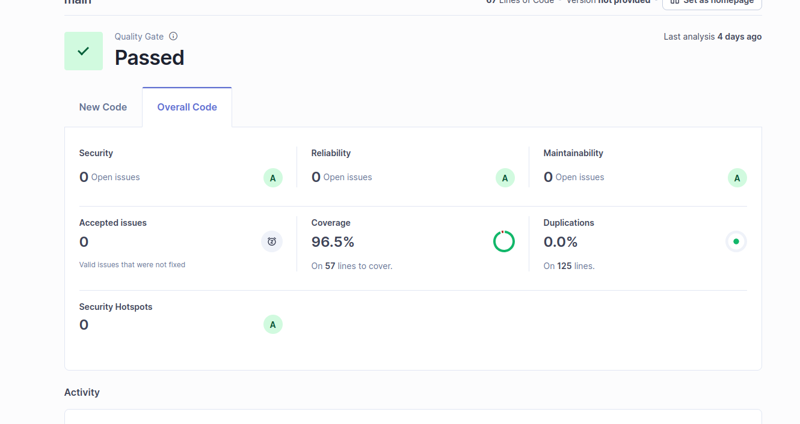

# CS-GradeCalculator

Sistema de cálculo de notas finales para el curso CS3081, diseñado para cumplir con estrictos requerimientos funcionales y no funcionales, priorizando la calidad del código y la arquitectura modular.


## Resultados de calidad y análisis SonarQube

### Rquerido


### Resultado del alumno en SonarQube



## 📋 Características

- **Cálculo de Promedio Ponderado**: Soporta evaluaciones con diferentes pesos.
- **Políticas de Asistencia**: Penalización automática si no se cumple con la asistencia mínima.
- **Puntos Extra**: Lógica para otorgar puntos adicionales bajo consenso docente.
- **Validaciones Robustas**:
  - Máximo 10 evaluaciones por estudiante.
  - Notas entre 0 y 20.
  - Pesos entre 0 y 100.
- **Arquitectura Limpia**: Separación clara entre Modelos, Lógica de Negocio y Constantes.

## 👤 Caso de Uso Principal

### CU0001 – Calcular nota final del estudiante
**Actor**: Docente UTEC

1. El docente ingresa a la aplicación.
2. La aplicación solicita los datos del estudiante (código o identificador).
3. El docente registra o revisa las evaluaciones con sus notas y pesos.
4. El docente indica si el estudiante alcanzó la asistencia mínima.
5. La aplicación consulta la política de puntos extra (lista `allYearsTeachers`).
6. La aplicación calcula la nota final.
7. La aplicación muestra la nota final y el detalle del cálculo.

## 🚀 Requisitos

- Python 3.10 o superior.

## 🛠️ Instalación y Ejecución

1.  **Clonar el repositorio**:
    ```bash
    git clone https://github.com/MarcoMadridG27/GradeCalculator.git
    cd GradeCalculator
    ```

2.  **Ejecutar la aplicación**:
    El sistema cuenta con una interfaz de línea de comandos (CLI) interactiva.
    ```bash
    python main.py
    ```

## 🧪 Pruebas

El proyecto incluye una suite de pruebas unitarias completa que cubre casos normales, casos borde y manejo de errores.

Para ejecutar todas las pruebas:
```bash
python -m unittest discover tests
```

Para generar un reporte de cobertura (requiere `coverage`):
```bash
pip install coverage
coverage run -m unittest discover tests
coverage report -m
```

## 📂 Estructura del Proyecto

```
GradeCalculator/
├── src/
│   ├── logic/              # Lógica de negocio (Calculadora, Políticas)
│   ├── model/              # Modelos de datos (Evaluación)
│   └── utils/              # Constantes y utilidades
├── tests/                  # Pruebas unitarias
├── .github/workflows/      # Configuración de CI/CD (SonarQube)
├── main.py                 # Punto de entrada de la aplicación
├── requirements.txt        # Dependencias del proyecto
├── sonar-project.properties # Configuración de SonarQube
└── README.md               # Documentación
```

## 🔍 Calidad de Código (SonarQube)

Este proyecto está integrado con **SonarQube** mediante **GitHub Actions** para asegurar la calidad continua del código.

- **Análisis Automático**: Se ejecuta en cada `push` a la rama `main`.
- **Cobertura**: Se reporta la cobertura de pruebas unitarias.
- **Clean Code**: Se siguen principios de código limpio, evitando "números mágicos" y manteniendo funciones pequeñas y cohesivas.

## 📝 Autor

Desarrollado para el Examen Parcial de CS3081 (2025-2).
